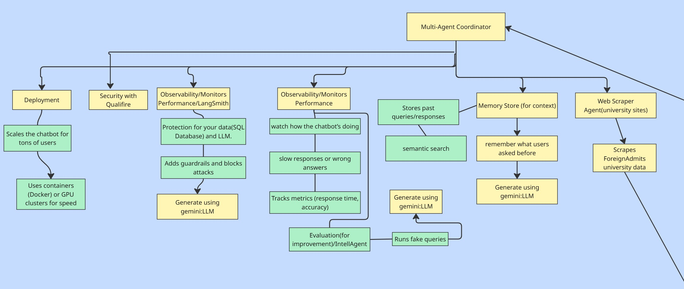
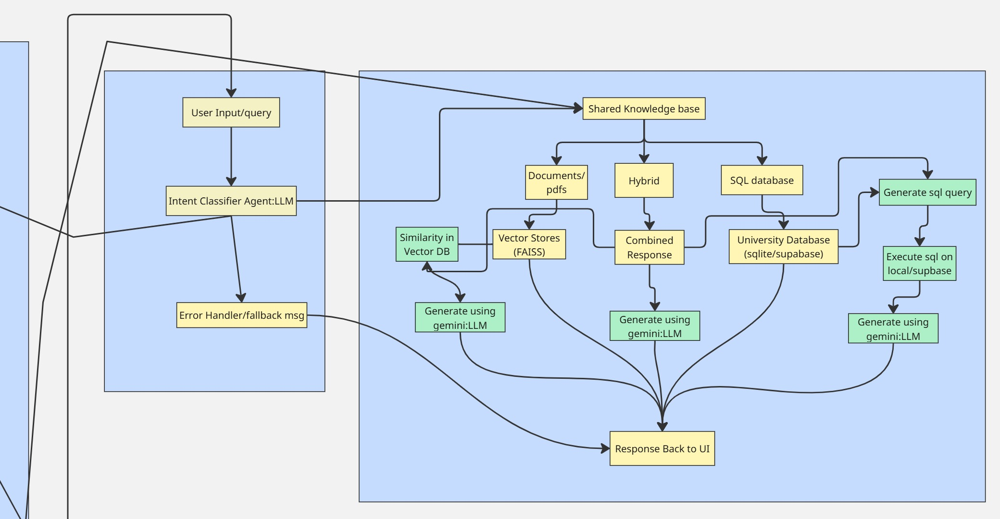
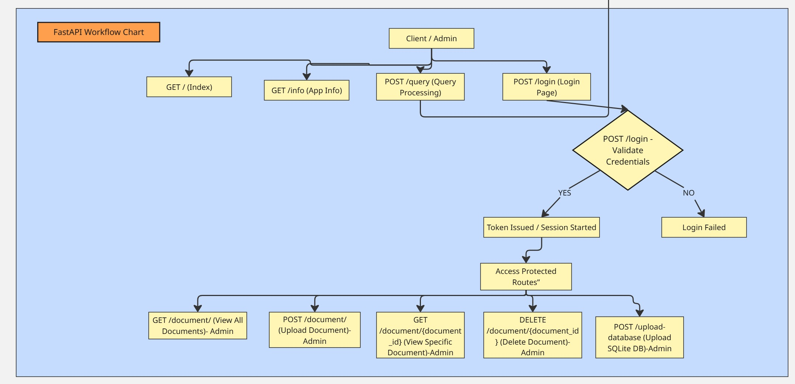

# Demo Videos

Watch the demo videos to get started:

- [Part 0](https://www.youtube.com/watch?v=pM2qLKKieYA)
- [Part 1](https://www.youtube.com/watch?v=DKrvY6mAKjs)
- [Part 2](https://www.youtube.com/watch?v=uZoPE9b_BDE)

---

# Deployed Application

Try out the live demo of the University Chatbot here:  
[https://query-chatbot-sumit.streamlit.app/](https://query-chatbot-sumit.streamlit.app/)

---

# University Chatbot

A user-friendly chatbot that answers university-related queries using Retrieval-Augmented Generation (RAG), Google Gemini API, and web scraping with Tavily API.


---

## Features

- Answers queries from `university_info.txt` and scraped web data.
- Multilingual support: English, Hindi, Spanish, French, German, and more.
- Text-to-Speech (TTS) audio responses.
- Feedback system with thumbs-up/thumbs-down.
- Follow-up question suggestions.
- Admin interface for website scraping and data management.
- Intuitive UI with sidebar, chat history, and example questions.
- Deployed on Streamlit Cloud.

---

## Advanced Security and Observability

Upcoming integrations to enhance security, tracing, and evaluation:

- **Qualifire:** Real-time guardrails against unsafe content and prompt injections.
- **LlamaFirewall:** Input/output security guardrails and tool access control.
- **Apex:** Security testing for prompt injection attacks.
- **LangSmith:** Observability with detailed tracing and monitoring.
- **IntellAgent:** Automated evaluation with behavioral analysis and metrics.
- **Intentbased/agentic** AI assistant that learns and adapts to the users.

---

## Overview

This project is designed for educational purposes and can be extended for real-world university admissions support. It allows users to:

- Upload CSV, XLSX, SQL, PDF, or TXT files containing university data.
- Query structured data (e.g., tuition fees) using SQL with NLP-driven query generation.
- Query unstructured data (e.g., application deadlines) using RAG with text indexing.
- Manage files and re-index data via an admin interface.
- Engage in multilingual conversations with text-to-speech support.

The chatbot is built using Streamlit for the frontend, Python for the backend, and integrates with external APIs for advanced functionality.

---

## Setup (Local)

1. Clone the repo:
   ```
   git clone https://github.com/sumitkumar005/chatbot.git
   cd chatbot
   ```

2. Create and activate a virtual environment:
   - Windows:
     ```
     python -m venv venv
     venv\Scripts\activate
     ```
   - Linux/Mac:
     ```
     python3 -m venv venv
     source venv/bin/activate
     ```

3. Install dependencies:
   ```
   pip install -r requirements.txt
   ```

4. Configure API keys in `.streamlit/secrets.toml`:
   ```
   [secrets]
   GOOGLE_API_KEY = "your-google-api-key"
   TAVILY_API_KEY = "your-tavily-api-key"
   ADMIN_PASSWORD = "admin123"
   ```

5. Add `university_info.txt` to the root directory.

6. Run the app:
   ```
   streamlit run main.py
   ```

7. Open [http://localhost:8501](http://localhost:8501).

---

## Deployment (Streamlit Cloud)

- Push to GitHub.
- Create an app on [share.streamlit.io](https://share.streamlit.io), select the repo, and set `main.py` as entry point.
- Add API keys in app settings.
- Deploy and test.

---

## Admin Features

- Login: Use password "admin123" to access admin features in the sidebar.
- Upload Files: Upload CSV, XLSX, SQL, PDF, or TXT files containing university data.
- Scrape Website: Enter a URL (e.g., https://www.visamonk.ai/) to scrape content.
- Delete Files: Remove uploaded files or the chatbot.db database.
- Re-Index Data: Refresh the FAISS index for text data.
- List Files: View current files in `data/` and `scraped_data/`.
- Change default admin password for security.

---

## Usage

- Ask questions like:
  - "What programs does the university offer?"
  - "What are the tuition fees?" (Try in Hindi: "ट्यूशन फीस क्या है?")
  - "What programs does MIT offer?" (after scraping)
- Click follow-up questions to explore more.
- Use the language selector to chat in multiple languages.
- Play audio responses and provide feedback.
- Reset conversation history via the sidebar.

---

## Sample Data

- CSV sample: `data/sample.csv` with university programs and tuition.
- TXT sample: `data/university_info.txt` with unstructured info.

---

## Troubleshooting

- Ensure data files are present and indexed.
- Re-upload and re-index if "Error: Unable to load knowledge base" appears.
- Delete `chatbot.db` only to reset database.
- Change admin password for security.

---

## Workflow Diagrams

Visual representation of the project workflow using Miro:


*Figure 1: Overview of the chatbot architecture and data flow.*


*Figure 2: Detailed process of data ingestion and indexing.*


*Figure 3: User interaction flow and admin features.*

---

## Contributing

Fork, submit issues or pull requests to add features or fix bugs.

---


